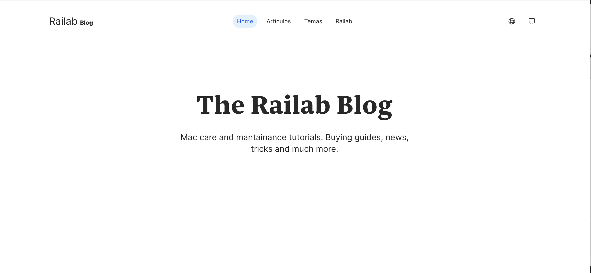

# The Railab Blog 
[Live preview](https://blog.railabtech.workers.dev/)




## About
This project has been planed using Obsidian, built with the Nuxt 3 framework, (partly to use and learn all is new features); TailwindCSS, designed on Figma [see prototype](https://www.figma.com/proto/pVXX2U1TjvpfwLzVOexRW1/blog.railab.tech?page-id=125%3A1689&node-id=125%3A2086&viewport=-55%2C420%2C0.11&scaling=scale-down).  It will be deployed on Cloudflare Workers as a server side rendered site.


The content hydration strategy is to use custom fetch calls to the Storyblok GraphQL api on page request, and populate a shared content state reference usign the new `useState` hook of Nuxt 3. this way every component can grab the data it need's on this object repository. Why, well native `nuxt/storyblok` it's nice but it's a litle bit bloated, this project it's taking Nuxt 3 for a ride, experimenting how much performant can it get, so just minimal dependencies allowed. 

It will support internationalization, Espanish as default language and English, using the `nuxti18n` module, currently on beta, but working properly.


## Content Types
Content types are described on `GraphQL` as it's a simpler format to communicate easily & precisly the types. All though internally actual content api calls might diverge while using the Stroyblok graphql api.


```graphql

Author {
    name     String
    bio      RichText
    avatar   URL
    slug     URL
    posts    [Post]!
}

Post {
    title         String
    post_picture  PostPicture
    authors       [Author]!
    content       RichText
    published_at  String
    updated_at    String
}

PostPicture {
    alt     String
    url     URL
}

Page {

    slug             String

    title            String
    description      String

    og-title         String
    og-description   String
    og-image         URL
    og-site_name     String
    og-url           URL

    twitter-image    URL
    twitter-card     "summary_large_image"
    twitter-site     @RailabMac
    twitter-title    String
}

```

### Components content structure (contentSchema)
This is the actuall implementation details of the components content structure

### DefaultLayout
```js

    i18nMetadata: {
        lang,
        dir
        alternateLinks
        ogLang
    }

    pageMetadata :{
        title,
        description,
        ogTitle,
        ogDescription,
        ogImage,
        ogSiteName,
        ogUrl,
        twitterCard,
        twitterTitle,
        twitterSite
    }

```
#### Storyblok Specifics
```js
    PageMetadata :{
        title,
        description,
        image
    }
```

### TheNavigation
The navigation data will be embeded on source leveraging nuxti18n content api.
```js
{
    links : [
        {
            text: 'Home',,
            route: '/'
        },
        {
            text: 'Posts',
            route: '/posts'
        }
        {
            text: 'Topics',
            route: '/topics'
        },
        {
            text: 'Authors',
            route: '/authors'
        }
    ],
    externalLink : {
        text: 'Go to Railab',
        url: 'https://railab.tech'
    }
}
```

### Home
####  Intro
```js
    {
        heading: '',
        copy: ''
    }
```


## Hot Zone

- [x] Make a composable for the content version (published or draft) to dynamically change in the fetchStoryblok hook

- [x] Make a global middleware to set the version based on a `content-version` cookie
- [x] Make a simple mechanism to toogle the content versions (privacy in mind)
  - Version selector route with a password query to match and them allow to select the content version
    - make a cookie for enable content version selection & another cookie for the content version